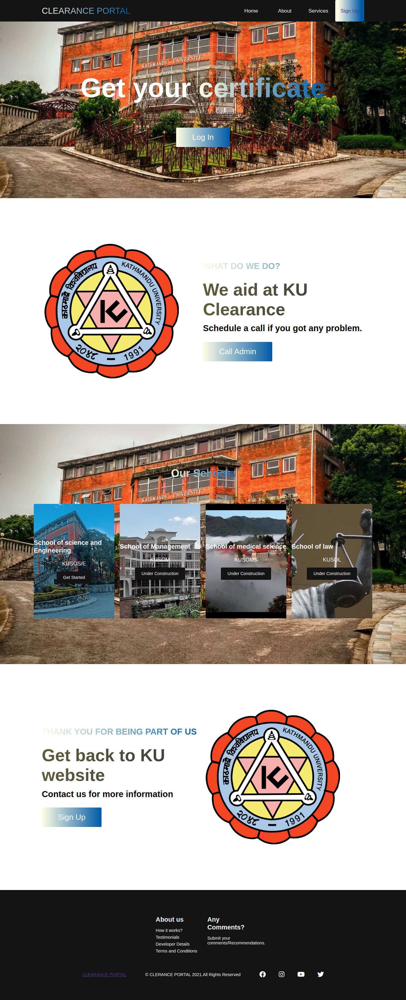
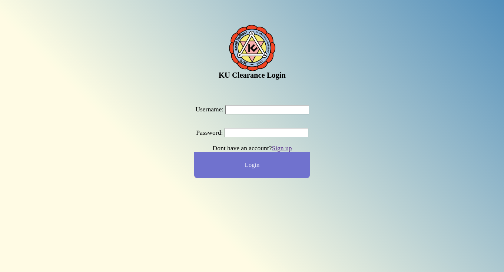
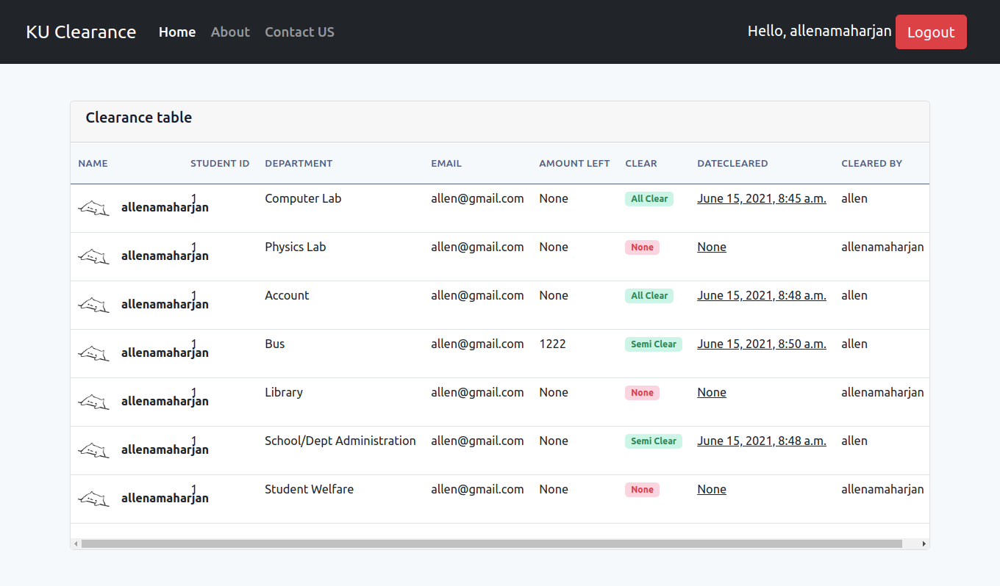
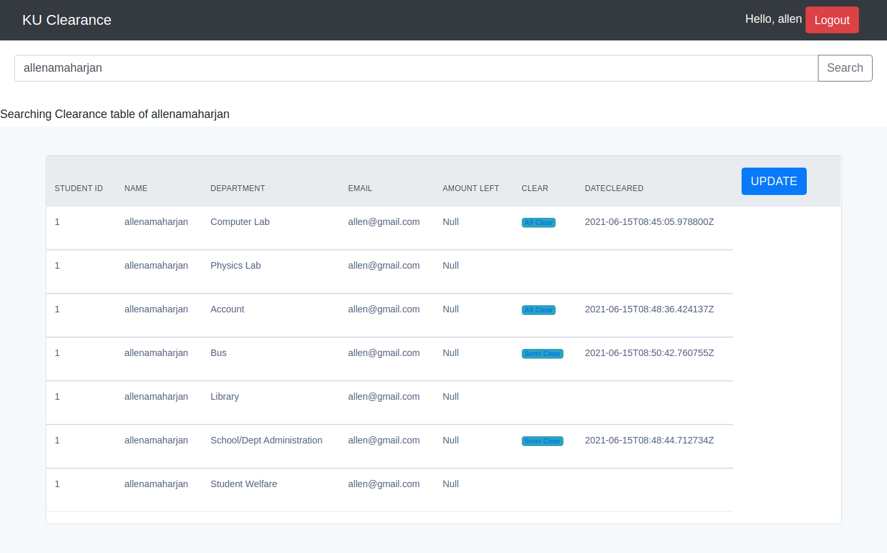

# Clearance_site
Fourth year project for the completion of Software Engineering.

Required packages:
<ul>
  <li>Django == 3.1 </li>
  <li>React </li>
  <li>Django rest framework </li>
  <li>babel </li>
  <li> webapck </li>
  <li>bootstrap v5 </li>
  <li> sass </li>
  <li>html</li>
</ul>

<h3> Home-page preview </h3> 

<h3> Login-page preview </h3>

<h3> Student-view preview </h3>

<h3> Staff-page preview </h3>

<h3> update-page preview </h3>

